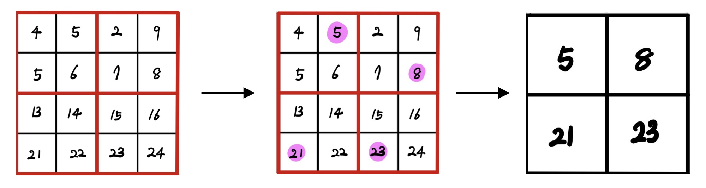
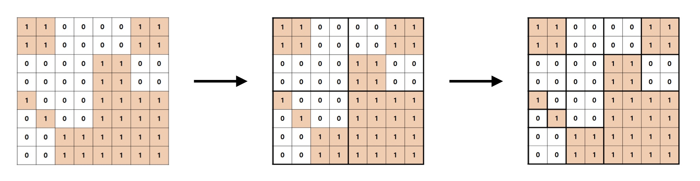

# Week7 Algorithm - 분할 정복법

## Problem 1: Pooling

아라는 투빅스에서 딥러닝을 공부하던 중, 이미지 처리에 흔히 쓰이는 합성곱 신경망(CNN)의 풀링 연산에 영감을 받아 자신만의 풀링을 만들고 이를 세컨드 풀링이라 부르기로 했다.

아라는 N x N 행렬에 세컨드 풀링을 반복해서 적용하여 크기를 1 x 1로 만들었을 때 어떤 값이 남아있을지 궁금해진다.

아라의 궁금증을 해결해주자!

다음은 4 x 4 행렬이 주어졌다고 가정했을 때 세컨드 풀링을 1회 적용하는 과정이다.
 
1. 행렬을 2 x 2 정사각형으로 나눈다.
2. 각 정사각형에서 2번째로 큰 수만 남긴다.  
    (정사각형의 네 원소를 a4<=a3<=a2<=a1 이라 했을 때, 원소 a2가 2번째로 큰 수이다.)
3. 2번 과정에 의해 행렬의 크기가 줄어든다.      
```
입력으로 첫째 줄에 N(2<=N<=1024)이 주어진다.
여기서 N은 항상 2의 거듭제곱 꼴이다(N<=2^k, 1<=k<=10).
다음 N개의 줄마다 각 행의 원소 N개가 차례대로 주어진다. 
행렬의 모든 성분은 -10,000이상 10,000 이하의 정수이다. 
출력의 마지막에 남은 수를 출력한다. 

입력:           출력:   
4               21  
4 5 2 9 
5 6 7 8 
13 14 15 16 
21 22 23 24 
```

## Problem 2: 교양 수업은 재미없다구

졸업을 위해 교양 수업을 듣고 있는 재영이는 지루함을 느낀다. 사고력을 키워준다는 교양 강의인데 꼼수만 느는 것 같다. 과제가 새로 올라왔다. 수리사고력을 키워준다는 이번 과제는 다음과 같다.       

여러 개의 정사각형칸으로 이루어진 N x N(N=2^k, 1<=k<=7) 크기의 정시각형이 나와 있는데, 각 칸은 흰색 또는 주황색으로 칠해져있다.       
전체 사각형이 모두 같은 색으로 칠해져 있지 않으면 똑같은 N//2 x N//2 의 크기로 사분할 해야 한다. 나누어진 각 사분면 사각형에서도 마찬가지로 모두 같은 색이 아니면 계속 사분할한다. 이와 같은 과정을 같은 색만 남을 때 까지 반복한다.      

아래와 같은 규칙으로 사각형을 분할해 갔을 때 흰색 정사각형과 주황색 정사각형의 개수를 구해야 한다.  

기탄 수학을 푸는 것 같은 기분이 드는 재영이는 이를 프로그래밍으로 빠르게 풀어버리려고 한다.     
꼼수를 쓰고 있는 재영이를 도와주자. 

~~~
첫째 줄에는 전체 사각형의 한 변의 길이 N이 주어진다.
(N은 2, 4, 8, 16, 32, 64, 128 중 하나)
두 번째 줄 부터 사각형 각 칸의 색이 주어진다. 
흰색은 0, 주황색은 1로 나타내었다. 
첫째 줄에 흰색 사각형의 개수를, 둘째 줄에 주황색 사각형의 개수를 출력한다. 

입력:               출력:
8                   9
1 1 0 0 0 0 1 1     7
1 1 0 0 0 0 1 1
0 0 0 0 1 1 0 0 
0 0 0 0 1 1 0 0 
1 0 0 0 1 1 1 1
0 1 0 0 1 1 1 1
0 0 1 1 1 1 1 1
0 0 1 1 1 1 1 1
~~~

## Problem 3: 회장님의 프러포즈

누구보다 눈에 띄는 프러포즈 방법을 고민하던 혜린이는 공개적인 장소에 현수막을 걸어 프러포즈를 하고자 했다.      
그러던 중 혜린이는 자신이 매입한 건물들이 생각났다. 그 건물들의 특징은 서로 연달아 지어졌다는 것이다.   

다만 소유 건물 외의 영역을 무단 침범할 경우 법적 조치가 요망되어 혜린이는 그 점을 주의하고 싶어한다.    

현수막 업체에 문의해보니 현수막은 직사각형 모양이어야만 하며, 크기의 제한은 없다고 한다. 혜린이는 자신의 건물만을 가리는 현수막의 최대 크기를 어떻게 구할 수 있을까?

~~~
첫 번째 줄에서는 건물의 개수 n(1<=N<=100,000)이 주어진다.   
두 번째 줄 부터 n 개의 정수가 주어지며, 이 숫자들은 각 건물마다의 높이를 의미한다.
건물의 높이는 0이상 1,000,000,000이하이고, 너비는 1이다. 
가장 넓이가 큰 현수막의 크기를 출력한다.    

입력:               출력: 
7                   8
2
1
4
5
1
3
3
~~~